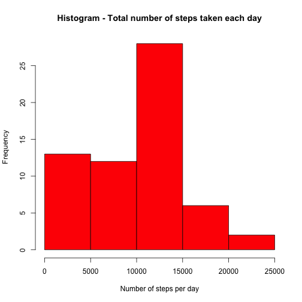

#Reproducible Research: Peer Assessment 1
##Introduction
It is now possible to collect a large amount of data about personal movement using activity monitoring devices such as a Fitbit, Nike Fuelband, or Jawbone Up. These type of devices are part of the “quantified self” movement – a group of enthusiasts who take measurements about themselves regularly to improve their health, to find patterns in their behavior, or because they are tech geeks. But these data remain under-utilized both because the raw data are hard to obtain and there is a lack of statistical methods and software for processing and interpreting the data.
This assignment makes use of data from a personal activity monitoring device. This device collects data at 5 minute intervals through out the day. The data consists of two months of data from an anonymous individual collected during the months of October and November, 2012 and include the number of steps taken in 5 minute intervals each day.

##Data

The data for this assignment has been downloaded from the course web site [ Activity monitoring data] [1] and stored locally as __activity.csv__
The variables included in this dataset are:
* __steps__: Number of steps taking in a 5-minute interval (missing values are
coded as NA)
* __date__: The date on which the measurement was taken in YYYY-MM-DD
format
* __interval__: Identifier for the 5-minute interval in which measurement was taken
The dataset is stored in a comma-separated-value (CSV) file and there are a total of 17,568 observations in this dataset.

##Loading and preprocessing the data
Show any code that is needed to
* Load the data (i.e. read.csv())
* Process/transform the data (if necessary) into a format suitable for your
analysis


```r
data <- read.csv("activity.csv")
data$date <- as.Date(data$date)
```


## What is mean total number of steps taken per day?
For this part of the assignment, __you can ignore the missing values__ in the dataset.
* Make a histogram of the total number of steps taken each day
* Calculate and report the mean and median total number of steps taken per day


```r
hist(tapply(data$steps, data$date, sum, na.rm = TRUE), main = "Histogram - Total number of steps taken each day", 
    col = "red", xlab = "Number of steps per day")
```

 

```r
mean(tapply(data$steps, data$date, sum, na.rm = TRUE))
```

```
## [1] 9354
```

```r
median(tapply(data$steps, data$date, sum, na.rm = TRUE))
```

```
## [1] 10395
```


__The mean total number of steps taken per day is 9354.2295 steps per day and the median is 10395 steps per day__

## What is the average daily activity pattern?
* Make a time series plot (i.e. type = "l") of the 5-minute interval (x-axis) and the average number of steps taken, averaged across all days (y-axis)


```r
MedSteps <- tapply(data$steps, data$interval, mean, na.rm = TRUE)
plot(dimnames(MedSteps)[[1]], MedSteps, type = "l", main = "Average number of steps in interval of 5 minutes", 
    xlab = "Minute of the day", ylab = "Steps per 5 minute")
```

 


* Which 5-minute interval, on average across all the days in the dataset, contains the maximum number of steps?

```r
intervalo = which.max(MedSteps)
intervalo
```

```
## 835 
## 104
```

__The 5-minute interval, on average across all the days in the dataset, which contains the maximum number or steps is the interval 835__


## Imputing missing values
Note that there are a number of days/intervals where there are missing values (coded as NA). The presence of missing days may introduce bias into some
calculations or summaries of the data.
* Calculate and report the total number of missing values in the dataset
(i.e. the total number of rows with NAs)

Examining the whole dataset, we can see the general characteristics of the data

```r
summary(data)
```

```
##      steps            date               interval   
##  Min.   :  0.0   Min.   :2012-10-01   Min.   :   0  
##  1st Qu.:  0.0   1st Qu.:2012-10-16   1st Qu.: 589  
##  Median :  0.0   Median :2012-10-31   Median :1178  
##  Mean   : 37.4   Mean   :2012-10-31   Mean   :1178  
##  3rd Qu.: 12.0   3rd Qu.:2012-11-15   3rd Qu.:1766  
##  Max.   :806.0   Max.   :2012-11-30   Max.   :2355  
##  NA's   :2304
```

As it can be seen in the summary, __there is only NA's in the steps field__

* Devise a strategy for filling in all of the missing values in the dataset. The strategy does not need to be sophisticated. For example, you could use the mean/median for that day, or the mean for that 5-minute interval, etc.

```r
# Analizing where are the NA
table(data$date, is.na(data$step))
```

```
##             
##              FALSE TRUE
##   2012-10-01     0  288
##   2012-10-02   288    0
##   2012-10-03   288    0
##   2012-10-04   288    0
##   2012-10-05   288    0
##   2012-10-06   288    0
##   2012-10-07   288    0
##   2012-10-08     0  288
##   2012-10-09   288    0
##   2012-10-10   288    0
##   2012-10-11   288    0
##   2012-10-12   288    0
##   2012-10-13   288    0
##   2012-10-14   288    0
##   2012-10-15   288    0
##   2012-10-16   288    0
##   2012-10-17   288    0
##   2012-10-18   288    0
##   2012-10-19   288    0
##   2012-10-20   288    0
##   2012-10-21   288    0
##   2012-10-22   288    0
##   2012-10-23   288    0
##   2012-10-24   288    0
##   2012-10-25   288    0
##   2012-10-26   288    0
##   2012-10-27   288    0
##   2012-10-28   288    0
##   2012-10-29   288    0
##   2012-10-30   288    0
##   2012-10-31   288    0
##   2012-11-01     0  288
##   2012-11-02   288    0
##   2012-11-03   288    0
##   2012-11-04     0  288
##   2012-11-05   288    0
##   2012-11-06   288    0
##   2012-11-07   288    0
##   2012-11-08   288    0
##   2012-11-09     0  288
##   2012-11-10     0  288
##   2012-11-11   288    0
##   2012-11-12   288    0
##   2012-11-13   288    0
##   2012-11-14     0  288
##   2012-11-15   288    0
##   2012-11-16   288    0
##   2012-11-17   288    0
##   2012-11-18   288    0
##   2012-11-19   288    0
##   2012-11-20   288    0
##   2012-11-21   288    0
##   2012-11-22   288    0
##   2012-11-23   288    0
##   2012-11-24   288    0
##   2012-11-25   288    0
##   2012-11-26   288    0
##   2012-11-27   288    0
##   2012-11-28   288    0
##   2012-11-29   288    0
##   2012-11-30     0  288
```

```r
# There are days with NA all day --> We can't use the mean/median for that
# day
table(data$interval, is.na(data$step))
```

```
##       
##        FALSE TRUE
##   0       53    8
##   5       53    8
##   10      53    8
##   15      53    8
##   20      53    8
##   25      53    8
##   30      53    8
##   35      53    8
##   40      53    8
##   45      53    8
##   50      53    8
##   55      53    8
##   100     53    8
##   105     53    8
##   110     53    8
##   115     53    8
##   120     53    8
##   125     53    8
##   130     53    8
##   135     53    8
##   140     53    8
##   145     53    8
##   150     53    8
##   155     53    8
##   200     53    8
##   205     53    8
##   210     53    8
##   215     53    8
##   220     53    8
##   225     53    8
##   230     53    8
##   235     53    8
##   240     53    8
##   245     53    8
##   250     53    8
##   255     53    8
##   300     53    8
##   305     53    8
##   310     53    8
##   315     53    8
##   320     53    8
##   325     53    8
##   330     53    8
##   335     53    8
##   340     53    8
##   345     53    8
##   350     53    8
##   355     53    8
##   400     53    8
##   405     53    8
##   410     53    8
##   415     53    8
##   420     53    8
##   425     53    8
##   430     53    8
##   435     53    8
##   440     53    8
##   445     53    8
##   450     53    8
##   455     53    8
##   500     53    8
##   505     53    8
##   510     53    8
##   515     53    8
##   520     53    8
##   525     53    8
##   530     53    8
##   535     53    8
##   540     53    8
##   545     53    8
##   550     53    8
##   555     53    8
##   600     53    8
##   605     53    8
##   610     53    8
##   615     53    8
##   620     53    8
##   625     53    8
##   630     53    8
##   635     53    8
##   640     53    8
##   645     53    8
##   650     53    8
##   655     53    8
##   700     53    8
##   705     53    8
##   710     53    8
##   715     53    8
##   720     53    8
##   725     53    8
##   730     53    8
##   735     53    8
##   740     53    8
##   745     53    8
##   750     53    8
##   755     53    8
##   800     53    8
##   805     53    8
##   810     53    8
##   815     53    8
##   820     53    8
##   825     53    8
##   830     53    8
##   835     53    8
##   840     53    8
##   845     53    8
##   850     53    8
##   855     53    8
##   900     53    8
##   905     53    8
##   910     53    8
##   915     53    8
##   920     53    8
##   925     53    8
##   930     53    8
##   935     53    8
##   940     53    8
##   945     53    8
##   950     53    8
##   955     53    8
##   1000    53    8
##   1005    53    8
##   1010    53    8
##   1015    53    8
##   1020    53    8
##   1025    53    8
##   1030    53    8
##   1035    53    8
##   1040    53    8
##   1045    53    8
##   1050    53    8
##   1055    53    8
##   1100    53    8
##   1105    53    8
##   1110    53    8
##   1115    53    8
##   1120    53    8
##   1125    53    8
##   1130    53    8
##   1135    53    8
##   1140    53    8
##   1145    53    8
##   1150    53    8
##   1155    53    8
##   1200    53    8
##   1205    53    8
##   1210    53    8
##   1215    53    8
##   1220    53    8
##   1225    53    8
##   1230    53    8
##   1235    53    8
##   1240    53    8
##   1245    53    8
##   1250    53    8
##   1255    53    8
##   1300    53    8
##   1305    53    8
##   1310    53    8
##   1315    53    8
##   1320    53    8
##   1325    53    8
##   1330    53    8
##   1335    53    8
##   1340    53    8
##   1345    53    8
##   1350    53    8
##   1355    53    8
##   1400    53    8
##   1405    53    8
##   1410    53    8
##   1415    53    8
##   1420    53    8
##   1425    53    8
##   1430    53    8
##   1435    53    8
##   1440    53    8
##   1445    53    8
##   1450    53    8
##   1455    53    8
##   1500    53    8
##   1505    53    8
##   1510    53    8
##   1515    53    8
##   1520    53    8
##   1525    53    8
##   1530    53    8
##   1535    53    8
##   1540    53    8
##   1545    53    8
##   1550    53    8
##   1555    53    8
##   1600    53    8
##   1605    53    8
##   1610    53    8
##   1615    53    8
##   1620    53    8
##   1625    53    8
##   1630    53    8
##   1635    53    8
##   1640    53    8
##   1645    53    8
##   1650    53    8
##   1655    53    8
##   1700    53    8
##   1705    53    8
##   1710    53    8
##   1715    53    8
##   1720    53    8
##   1725    53    8
##   1730    53    8
##   1735    53    8
##   1740    53    8
##   1745    53    8
##   1750    53    8
##   1755    53    8
##   1800    53    8
##   1805    53    8
##   1810    53    8
##   1815    53    8
##   1820    53    8
##   1825    53    8
##   1830    53    8
##   1835    53    8
##   1840    53    8
##   1845    53    8
##   1850    53    8
##   1855    53    8
##   1900    53    8
##   1905    53    8
##   1910    53    8
##   1915    53    8
##   1920    53    8
##   1925    53    8
##   1930    53    8
##   1935    53    8
##   1940    53    8
##   1945    53    8
##   1950    53    8
##   1955    53    8
##   2000    53    8
##   2005    53    8
##   2010    53    8
##   2015    53    8
##   2020    53    8
##   2025    53    8
##   2030    53    8
##   2035    53    8
##   2040    53    8
##   2045    53    8
##   2050    53    8
##   2055    53    8
##   2100    53    8
##   2105    53    8
##   2110    53    8
##   2115    53    8
##   2120    53    8
##   2125    53    8
##   2130    53    8
##   2135    53    8
##   2140    53    8
##   2145    53    8
##   2150    53    8
##   2155    53    8
##   2200    53    8
##   2205    53    8
##   2210    53    8
##   2215    53    8
##   2220    53    8
##   2225    53    8
##   2230    53    8
##   2235    53    8
##   2240    53    8
##   2245    53    8
##   2250    53    8
##   2255    53    8
##   2300    53    8
##   2305    53    8
##   2310    53    8
##   2315    53    8
##   2320    53    8
##   2325    53    8
##   2330    53    8
##   2335    53    8
##   2340    53    8
##   2345    53    8
##   2350    53    8
##   2355    53    8
```

```r
# There is no interval with NA all interval --> We can use the mean/media
# for each interval as a strategy for filling the NA
```


* Create a new dataset that is equal to the original dataset but with the missing data filled in.

```r
# Mean step across all days --> MedSteps
MedSteps <- tapply(data$steps, data$interval, mean, na.rm = TRUE)
# Function to filling na with mean from MedSteps
filling <- function(data) {
    temp <- data
    for (i in 1:nrow(data)) {
        if (is.na(data$steps[i]) == TRUE) {
            temp$steps[i] = MedSteps[as.character(data$interval[i])]
        }
    }
    temp
}
# New data set without NA
datafilled = filling(data)
summary(datafilled)
```

```
##      steps            date               interval   
##  Min.   :  0.0   Min.   :2012-10-01   Min.   :   0  
##  1st Qu.:  0.0   1st Qu.:2012-10-16   1st Qu.: 589  
##  Median :  0.0   Median :2012-10-31   Median :1178  
##  Mean   : 37.4   Mean   :2012-10-31   Mean   :1178  
##  3rd Qu.: 27.0   3rd Qu.:2012-11-15   3rd Qu.:1766  
##  Max.   :806.0   Max.   :2012-11-30   Max.   :2355
```


* Make a histogram of the total number of steps taken each day and Calculate and report the mean and median total number of steps taken per day. Do these values differ from the estimates from the first part of the assignment? What is the impact of imputing missing data on the estimates of the total daily number of steps?


```r
# Histogram with new data without NA
hist(tapply(datafilled$steps, datafilled$date, sum), main = "Histogram 2- Total number of steps taken each day (filled NA)", 
    col = "red", xlab = "Number of steps per day")
```

 

```r
mean(tapply(datafilled$steps, datafilled$date, sum))
```

```
## [1] 10766
```

```r
median(tapply(datafilled$steps, datafilled$date, sum))
```

```
## [1] 10766
```


### Comparative with and without NA
__Histograms__

```r
par(mfrow = c(2, 1))
hist(tapply(data$steps, data$date, sum, na.rm = TRUE), main = "Histogram 1 - Total number of steps taken each day", 
    col = "red", xlab = "Number of steps per day")
hist(tapply(datafilled$steps, datafilled$date, sum), main = "Histogram 2- Total number of steps taken each day (filled NA)", 
    col = "red", xlab = "Number of steps per day")
```

 

__Change in mean and median__

```r
# With NA
mean(tapply(data$steps, data$date, sum, na.rm = TRUE))
```

```
## [1] 9354
```

```r
median(tapply(data$steps, data$date, sum, na.rm = TRUE))
```

```
## [1] 10395
```

```r
# Without NA
mean(tapply(datafilled$steps, datafilled$date, sum))
```

```
## [1] 10766
```

```r
median(tapply(datafilled$steps, datafilled$date, sum))
```

```
## [1] 10766
```


## Are there differences in activity patterns between weekdays and weekends?
For this part the weekdays() function may be of some help here. Use the dataset with the filled-in missing values for this part.
* Create a new factor variable in the dataset with two levels – “weekday” and “weekend” indicating whether a given date is a weekday or weekend day.

```r
# New variable in dataset with value 'weekday'
datafilled$day = "weekday"
# Change to 'weekend' if date is 'sábado' or 'domingo' (locale Spain)
datafilled$day[weekdays(datafilled$date) == "sábado"] = "weekend"
datafilled$day[weekdays(datafilled$date) == "domingo"] = "weekend"
datafilled$day = as.factor(datafilled$day)
```


Make a panel plot containing a time series plot (i.e. type = "l") of the 5-minute interval (x-axis) and the average number of steps taken, averaged across all weekday days or weekend days (y-axis).

```r
# Calculate of average number of steps taken each 5 minute interval,
# averaged across all weekday days or weekend days
meanweekend = tapply(datafilled$steps[datafilled$day == "weekend"], data$interval[datafilled$day == 
    "weekend"], mean)
meanweekday = tapply(datafilled$steps[datafilled$day == "weekday"], data$interval[datafilled$day == 
    "weekday"], mean)
par(mfrow = c(2, 1))
plot(dimnames(meanweekend)[[1]], meanweekend, type = "l", main = "Average number of steps in interval of 5 minutes Weekend", 
    xlab = "", ylab = "Steps per 5 minute")
plot(dimnames(meanweekday)[[1]], meanweekday, type = "l", main = "Average number of steps in interval of 5 minutes Weekday", 
    xlab = "Minute of the day", ylab = "Steps per 5 minute")
```

 


[1]: https://d396qusza40orc.cloudfront.net/repdata%2Fdata%2Factivity.zip "Activity Monitoring Data"
